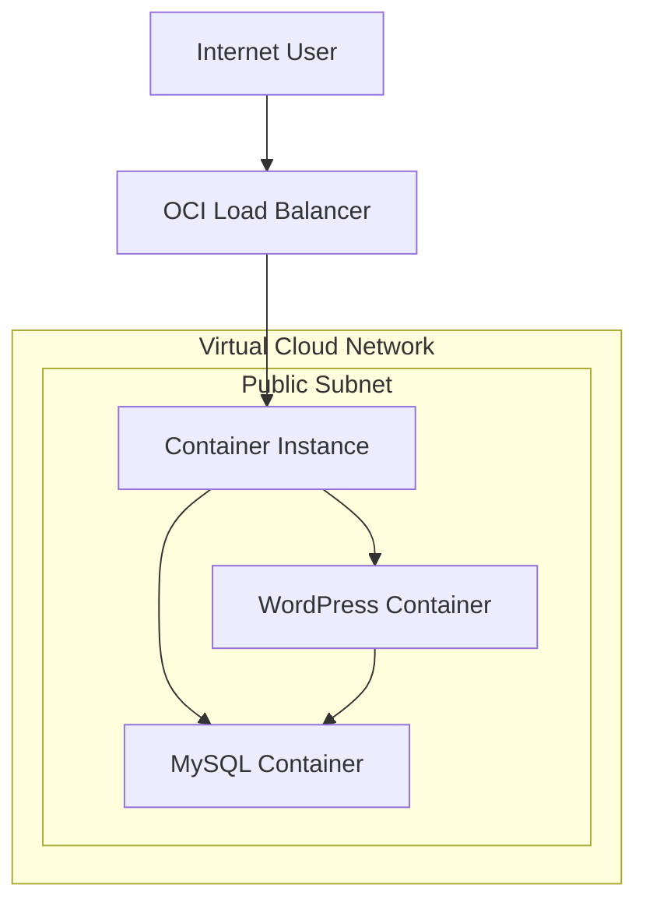

# Bienvenidos a Oracle Training Labs
## Laboratorio de Container Instances 
## Despliegue de Wordpress
#### El laboratorio consiste en el despliegue de Wordpress en una subred privada utilizando una Base de Datos MySQL creada en otro container dentro de la misma instancia. La seguridad lo mas importante !!! 

#### Para acceder a nuestro sistema Wordpress vamos a crear un Load Balancer publico protegido por un WAF (Web Appplication Firewall) como proteccion a posibles ciberataques


#### Prerrequisitos para la realizacion del Laboratorio
* Creacion de VCN y subredes, una publica y una privada
* Creacion de Internet Gateway y entrada en la tabla de rutas para la subred publica
* Creacion de NAT Gateway y entrada en la tabla de rutas para la subred privada
+ Configuracion de Security Lists:
  + Para la subred publica permitir el trafico por los puertos 80 y 3306
  + Para la subred privada permitir todo el trafico desde la subred publica
  
# 1. Creación de Container Instance

### Menu principal >Developer Services > Container instances


## Configuración de la instancia
Debemos ingresar la informacion del nombre de la instancia, AD, Shape y capacidades de computo(OCPU y Memoria RAM)


En la parte de Networking seleccionamos la VCN y la subred privada


### Configuración de los contenedores
En esta parte vamos a asignar los nombres de los contenedores, para ello seleccionamos las imagenes a utilizar y creamos las variables de ambiente que necesita el contenedor para funcionar adecuadamente. Para el laboratorio vamos a utilizar las imagenes publicas del Docker Hub

### El primer container a crear es el de MySQL
Asignamos un nombre al container y seleccionamos la imagen a descargar desde el Docker Hub


Configuracion de las variables de ambiente necesarias para el despliegue del container MySQL
Click en crear another container


### El segundo container a crear es el de Wordpress
Asignamos un nombre al container y seleccionamos la imagen a descargar desde el Docker Hub


Configuracion de las variables de ambiente necesarias para el despliegue del container Wordpress
El valor de la variable WORDPRESS_DB_HOST corresponde a la IP seleccionada durante la creacion del Container Instance en la parte de Networking


Click en Create


# 2. Creación del Load Balancer

#### Para acceder de forma publica al servicio de Wordpress es necesario configurar un Load Balancer para recibir el trafico desde internet

### Menu principal > Networking > Load Balancers


Asignamos el nombre del LB y seleccionamos las opciones de visibilidad publica e IP


Seleccionamos la VCN y la subred publica ceeada durante los prerrequisitos


Luego seleccionamos el algoritmo de balanceo del trafico y el protocolo y puerto para el  Check. En la imagen se muestra el  check utilizando el protocolo TCP/80 con codigo de respuesta 200.
Tambien se podria utilizar HTTP/80 con codigo de respuesta 302.


Configuramos el listener de tipo HTTP (las peticiones ingresan por el puerto 80)


Activamos los logs del LB


Adicionamos el Backend, este corresponde a la Container Instance


El backend corresponde a la IP privada del Container Instance


# Practica avanzada - de Monolito a Contenedor

# WordPress on Oracle Cloud Container Instances


Este lab muestra cómo **convertir una aplicación monolítica (WordPress + MySQL) en contenedores** y desplegarla en **Oracle Cloud Infrastructure (OCI)** utilizando:

- OCI Container Registry (OCIR)
- OCI Container Instances
- OCI Load Balancer
- Virtual Cloud Network (VCN)

---

# Arquitectura



Flujo de tráfico:

```
Internet
   │
OCI Load Balancer
   │
Container Instance
   ├── WordPress
   └── MySQL
```

---

# Prerrequisitos

Antes de comenzar necesitas:

- Docker instalado (recomendado utilizar Cloud Shell de OCI)
- Cuenta en docker hub
- Auth Token de OCI
- OCI CLI (opcional)

Servicios OCI utilizados:

- Container Registry
- Container Instances
- Load Balancer
- VCN

---

# Estructura del repositorio

- mkdir docker

```
oci-wordpress-demo/
│
├ docker/
│   ├ Dockerfile.wordpress
│   └ Dockerfile.mysql
|   └ health.html
│
└ README.md
```

---

# Health Check Endpoint

Archivo:

```
health.html
```

Contenido:

```html
OK
```

Este endpoint será utilizado por el **Load Balancer** para verificar la salud del contenedor.

---

# Dockerfile WordPress

Archivo:

```
Dockerfile.wordpress
```

Contenido:

```dockerfile
FROM docker.io/library/wordpress:php8.2-apache

COPY health.html /var/www/html/health.html

ENV WORDPRESS_DB_HOST=localhost
ENV WORDPRESS_DB_USER=wpuser
ENV WORDPRESS_DB_NAME=wpdb

EXPOSE 80
```

Explicación:

- Usa la imagen oficial de WordPress
- Agrega un endpoint de health check
- Expone el puerto 80

---

# Dockerfile MySQL

Archivo:

```
Dockerfile.mysql
```

Contenido:

```dockerfile
FROM docker.io/library/mysql:8.0

ENV MYSQL_DATABASE=wpdb
ENV MYSQL_USER=wpuser

EXPOSE 3306
```

Las contraseñas se configurarán en runtime mediante variables de entorno.

---

# Construir las imágenes

Hacer login en docker hub con los usuarios creados previamente:
- docker login docker.io

Desde el directorio raíz del proyecto ejecutar:

```bash
docker build -t wordpress-demo -f docker/Dockerfile.wordpress .
docker build -t mysql-demo -f docker/Dockerfile.mysql .
```

Verificar:

```bash
docker images
```

---

# Login en OCI Container Registry (OCIR)

Autenticarse contra el registry de OCI.

Formato:

```
docker login <region>.ocir.io
```

Ejemplo:

```bash
docker login iad.ocir.io
```

Usuario:

```
<tenancy-namespace>/<domain>/<username>
```

Password:

```
OCI Auth Token
```

El Auth Token se genera desde:

```
OCI Console
→ User Settings
→ Auth Tokens
```

---

# Taggear imágenes para OCIR

Formato requerido por OCI:

```
<region>.ocir.io/<tenancy-namespace>/<repository>/<image>:<tag>
```

Ejemplo:

```bash
docker tag wordpress-demo iad.ocir.io/mytenancy/demo/wordpress:1.0
docker tag mysql-demo iad.ocir.io/mytenancy/demo/mysql:1.0
```

---

# Subir imágenes a OCIR

- Obtener namespace desde: Profile --> Tenancy --> Object storage namespace
Subir imágenes al registry:

```bash
docker push iad.ocir.io/namespace/demo/wordpress:1.0
docker push iad.ocir.io/namespace/demo/mysql:1.0
```

Las imágenes quedarán disponibles en:

```
OCI Console
→ Developer Services
→ Container Registry
```

---

# Crear Container Instance

Ir a:

```
Developer Services
→ Container Instances
```

Crear una instancia con **dos contenedores**.

---

## MySQL Container

Imagen:

```
<region>.ocir.io/mytenancy/demo/mysql:1.0
```

Variables de entorno:

```
MYSQL_ROOT_PASSWORD=rootpassword
MYSQL_PASSWORD=wppassword
MYSQL_DATABASE=wpdb
MYSQL_USER=wpuser
```

Puerto:

```
3306
```

---

## WordPress Container

Imagen:

```
<region>.ocir.io/mytenancy/demo/wordpress:1.0
```

Variables:

```
WORDPRESS_DB_HOST=localhost
WORDPRESS_DB_USER=wpuser
WORDPRESS_DB_PASSWORD=wppassword
WORDPRESS_DB_NAME=wpdb
```

Puerto:

```
80
```

---

# Comunicación entre contenedores

Los contenedores dentro del mismo **Container Instance** comparten red.

WordPress puede conectarse a MySQL usando:

```
localhost:3306
```

---

# Crear Load Balancer

Ir a:

```
Networking
→ Load Balancers
```

Crear **Public Load Balancer**.

Configuración:

Listener:

```
Protocol: HTTP
Port: 80
```

Backend:

```
Target: Container Instance
Port: 80
```

---

# Configurar Health Check

Path:

```
/health.html
```

Expected response:

```
HTTP 200
```

Esto permite al Load Balancer verificar que WordPress está funcionando correctamente.

---

# Acceder a WordPress

Una vez desplegado el Load Balancer:

```
http://<public-ip>
```

Aparecerá el instalador de WordPress.

---

# Resultado final

Arquitectura desplegada:

```
Internet
   │
OCI Load Balancer
   │
Container Instance
   ├ WordPress
   └ MySQL
```

---

# Mejoras para producción

Para un entorno productivo se recomienda:

- Base de datos gestionada (OCI MySQL DB System)
- Persistencia de almacenamiento
- HTTPS con certificados TLS
- Gestión segura de secretos
- Observabilidad y logging
- Escalamiento horizontal
