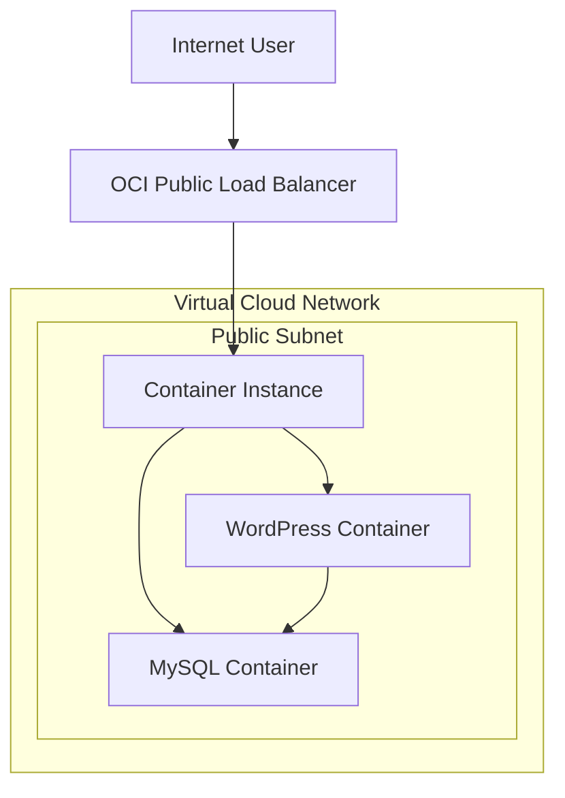

# Bienvenidos a Oracle Training Labs
## Laboratorio de Container Instances 
## Despliegue de Wordpress
#### El laboratorio consiste en el despliegue de Wordpress en una subred privada utilizando una Base de Datos MySQL creada en otro container dentro de la misma instancia. La seguridad lo mas importante !!! 

#### Para acceder a nuestro sistema Wordpress vamos a crear un Load Balancer publico protegido por un WAF (Web Appplication Firewall) como proteccion a posibles ciberataques


#### Prerrequisitos para la realizacion del Laboratorio
* Creacion de VCN y subredes, una publica y una privada
* Creacion de Internet Gateway y entrada en la tabla de rutas para la subred publica
* Creacion de NAT Gateway y entrada en la tabla de rutas para la subred privada
+ Configuracion de Security Lists:
  + Para la subred publica permitir el trafico por los puertos 80 y 3306
  + Para la subred privada permitir todo el trafico desde la subred publica
  
# 1. Creación de Container Instance

### Menu principal >Developer Services > Container instances


## Configuración de la instancia
Debemos ingresar la informacion del nombre de la instancia, AD, Shape y capacidades de computo(OCPU y Memoria RAM)


En la parte de Networking seleccionamos la VCN y la subred privada


### Configuración de los contenedores
En esta parte vamos a asignar los nombres de los contenedores, para ello seleccionamos las imagenes a utilizar y creamos las variables de ambiente que necesita el contenedor para funcionar adecuadamente. Para el laboratorio vamos a utilizar las imagenes publicas del Docker Hub

### El primer container a crear es el de MySQL
Asignamos un nombre al container y seleccionamos la imagen a descargar desde el Docker Hub


Configuracion de las variables de ambiente necesarias para el despliegue del container MySQL
Click en crear another container


### El segundo container a crear es el de Wordpress
Asignamos un nombre al container y seleccionamos la imagen a descargar desde el Docker Hub


Configuracion de las variables de ambiente necesarias para el despliegue del container Wordpress
El valor de la variable WORDPRESS_DB_HOST corresponde a la IP seleccionada durante la creacion del Container Instance en la parte de Networking


Click en Create


# 2. Creación del Load Balancer

#### Para acceder de forma publica al servicio de Wordpress es necesario configurar un Load Balancer para recibir el trafico desde internet

### Menu principal > Networking > Load Balancers


Asignamos el nombre del LB y seleccionamos las opciones de visibilidad publica e IP


Seleccionamos la VCN y la subred publica ceeada durante los prerrequisitos


Luego seleccionamos el algoritmo de balanceo del trafico y el protocolo y puerto para el Health Check. En la imagen se muestra el Health check utilizando el protocolo TCP/80 con codigo de respuesta 200.
Tambien se podria utilizar HTTP/80 con codigo de respuesta 302.


Configuramos el listener de tipo HTTP (las peticiones ingresan por el puerto 80)


Activamos los logs del LB


Adicionamos el Backend, este corresponde a la Container Instance


El backend corresponde a la IP privada del Container Instance


#Practica avanzada - de Monolito a Contenedor

# Arquitectura OCI

Este proyecto despliega una aplicación **WordPress contenedorizada** utilizando servicios de **Oracle Cloud Infrastructure (OCI)**.

La arquitectura utiliza:

- OCI Container Registry (OCIR)
- OCI Container Instances
- OCI Load Balancer
- Virtual Cloud Network (VCN)

El objetivo es demostrar cómo **contenedizar una aplicación monolítica** y desplegarla en una infraestructura cloud moderna utilizando contenedores.

---

# Diagrama de Arquitectura



---

# Descripción de la Arquitectura

La arquitectura se compone de los siguientes elementos:

### Internet

Los usuarios acceden a la aplicación WordPress desde Internet mediante HTTP.

### OCI Load Balancer

El **Load Balancer público** actúa como punto de entrada a la aplicación.

Funciones principales:

- Exponer la aplicación a Internet
- Distribuir tráfico hacia el backend
- Ejecutar health checks
- Proteger el backend de acceso directo

Configuración típica:

- Listener HTTP puerto 80
- Backend apuntando al Container Instance
- Health check en `/health.html`

---

### Virtual Cloud Network (VCN)

La **VCN** es la red virtual donde se despliegan los recursos de la aplicación.

Componentes:

- Subnet pública
- Security Lists o Network Security Groups
- Rutas hacia Internet Gateway

La VCN permite aislar y controlar el tráfico entre recursos.

---

### Public Subnet

El **Container Instance** se despliega en una **subnet pública** para permitir que el Load Balancer pueda enrutar tráfico hacia él.

Reglas comunes:

Entrada:

- HTTP 80 desde Load Balancer

Salida:

- Acceso a Internet para descargar imágenes del registry

---

### Container Instance

El **Container Instance** ejecuta múltiples contenedores dentro del mismo entorno.

En este proyecto contiene:

- WordPress container
- MySQL container

Ambos contenedores comparten:

- red
- localhost
- ciclo de vida

Esto permite que WordPress se conecte a MySQL usando:

```
localhost:3306
```

---

### WordPress Container

El contenedor WordPress ejecuta la aplicación web.

Imagen base:

```
wordpress:php8.2-apache
```

Configuración principal:

Variables de entorno:

```
WORDPRESS_DB_HOST=localhost
WORDPRESS_DB_USER=wpuser
WORDPRESS_DB_PASSWORD=wppassword
WORDPRESS_DB_NAME=wpdb
```

Puerto expuesto:

```
80
```

Además se incluye un endpoint de salud:

```
/health.html
```

Este endpoint es utilizado por el Load Balancer para verificar que el contenedor está funcionando correctamente.

---

### MySQL Container

El contenedor MySQL actúa como base de datos para WordPress.

Imagen base:

```
mysql:8.0
```

Variables de entorno:

```
MYSQL_ROOT_PASSWORD=rootpassword
MYSQL_DATABASE=wpdb
MYSQL_USER=wpuser
MYSQL_PASSWORD=wppassword
```

Puerto expuesto:

```
3306
```

---

# Flujo de tráfico

El flujo de solicitudes funciona de la siguiente manera:

1. El usuario accede a la aplicación desde su navegador.
2. La solicitud llega al **OCI Load Balancer**.
3. El Load Balancer enruta el tráfico al **Container Instance**.
4. La solicitud es atendida por el **WordPress container**.
5. WordPress se conecta a **MySQL** utilizando `localhost`.
6. MySQL devuelve los datos necesarios para generar la página.
7. WordPress responde al usuario.

Flujo simplificado:

```
Internet
   │
OCI Load Balancer
   │
Container Instance
   ├── WordPress
   └── MySQL
```

---

# Beneficios de esta arquitectura

Esta arquitectura proporciona varias ventajas:

### Contenedorización

Permite empaquetar la aplicación con todas sus dependencias.

### Portabilidad

Las imágenes Docker pueden ejecutarse en cualquier entorno compatible.

### Despliegue rápido

Las imágenes pueden desplegarse rápidamente desde **OCI Container Registry**.

### Simplificación de infraestructura

El servicio **Container Instances** elimina la necesidad de administrar máquinas virtuales.

### Escalabilidad

La arquitectura puede evolucionar hacia:

- múltiples container instances
- balanceo de carga avanzado
- base de datos gestionada

---

# Mejoras recomendadas para producción

Para un entorno productivo se recomienda:

- Utilizar **OCI MySQL Database Service** en lugar de MySQL en contenedor
- Configurar almacenamiento persistente
- Implementar gestión de secretos
- Habilitar observabilidad y logging
- Configurar HTTPS con certificados TLS
- Implementar auto scaling

---

# Arquitectura final desplegada

```
Internet
   │
OCI Load Balancer
   │
VCN
   │
Public Subnet
   │
Container Instance
   ├── WordPress Container
   └── MySQL Container
```
